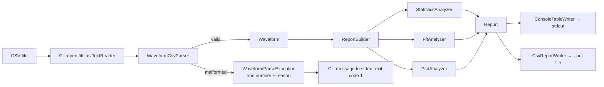
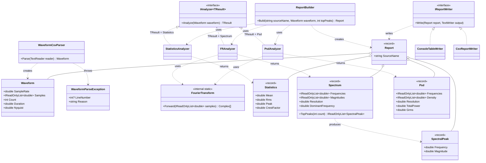

# Design — Waveform Analysis Toolkit

| | |
|---|---|
| **Status** | Accepted for Iteration 1 |
| **Author** | Travis |
| **Requirements** | [requirements.md](requirements.md) |
| **Definition of Done** | [definition-of-done.md](definition-of-done.md) |
| **Target** | .NET 10 (LTS), C#, Visual Studio 2026 |

---

## 1. Context & goals

The toolkit imports a single-channel vibration recording (time, acceleration),
computes time-domain statistics and frequency-domain results, and writes a
report. It implements FR-01 … FR-07 in `requirements.md`.

Design goals, in priority order:

1. **Correctness** — results match theory on synthetic signals (NFR-01).
2. **Testability** — all logic lives in a Core library with no console or
   file-system access, so every behavior is unit-testable (NFR-05).
3. **Locale independence** — parsing and formatting never depend on OS
   culture settings (NFR-03).
4. **Simplicity** — the smallest design that satisfies the requirements;
   abstractions are added only when a second implementation exists.

---

## 2. Architecture overview

Dependencies point **toward Core only**. Core references no other project.

| Project | Responsibility | References |
|---|---|---|
| `WaveformToolkit.Core` | Parsing, analysis, report model, report writers | MathNet.Numerics (NuGet) |
| `WaveformToolkit.Cli` | Argument parsing, opening files, exit codes | Core |
| `WaveformToolkit.Core.Tests` | Unit tests for Core | Core |
| `WaveformToolkit.Cli.Tests` *(added in Iteration 3)* | End-to-end CLI tests | Cli, Core |

### Core folder / namespace layout

| Folder | Namespace | Contents |
|---|---|---|
| `/` | `WaveformToolkit.Core` | `Waveform` |
| `Import/` | `WaveformToolkit.Core.Import` | `WaveformCsvParser`, `WaveformParseException` |
| `Analysis/` | `WaveformToolkit.Core.Analysis` | `IAnalyzer<TResult>`, analyzers, result records, `FourierTransform` (internal) |
| `Reporting/` | `WaveformToolkit.Core.Reporting` | `Report`, `ReportBuilder`, `IReportWriter`, writers |

### Boundary rule
Core accepts `TextReader` and writes to `TextWriter`; it never opens files or
touches `Console`. Tests use `StringReader` / `StringWriter`, so they are fast,
deterministic, and need no temporary files. Only `WaveformToolkit.Cli` opens
files and maps outcomes to exit codes.

---

## 3. Data flow



---

## 4. Domain model

### 4.1 `Waveform` (immutable class)

| Member | Type | Definition |
|---|---|---|
| `SampleRate` | `double` | Samples per second (Hz) |
| `Samples` | `IReadOnlyList<double>` | Acceleration values (g) |
| `Count` | `int` | `Samples.Count` |
| `Duration` | `double` | `Count / SampleRate` (s) |
| `Nyquist` | `double` | `SampleRate / 2` (Hz) |

**Invariants (enforced in the constructor):**

| Condition | Exception |
|---|---|
| `SampleRate` ≤ 0, NaN, or infinite | `ArgumentOutOfRangeException` |
| `samples` is null | `ArgumentNullException` |
| fewer than 2 samples | `ArgumentException` |
| any sample is NaN or infinite | `ArgumentException` |

The constructor copies the input into a private array so later changes to the
caller's collection cannot mutate the `Waveform`.

### 4.2 Result types (C# `record`s)

| Record | Members |
|---|---|
| `Statistics` | `double Mean`, `double Rms`, `double Peak`, `double CrestFactor` |
| `Spectrum` | `IReadOnlyList<double> Frequencies`, `IReadOnlyList<double> Magnitudes`, `double Resolution`, `double DominantFrequency`, `IReadOnlyList<SpectralPeak> TopPeaks(int count)` |
| `SpectralPeak` | `double Frequency`, `double Magnitude` |
| `Psd` | `IReadOnlyList<double> Frequencies`, `IReadOnlyList<double> Density`, `double Resolution`, `double TotalPower`, `double Grms` |
| `Report` | `string SourceName`, `Waveform Waveform`, `Statistics Statistics`, `Spectrum Spectrum`, `Psd Psd`, `IReadOnlyList<SpectralPeak> Peaks` |

Collections are exposed as `IReadOnlyList<double>` rather than `double[]` so
callers cannot modify results.

---

## 5. Component contracts

| Component | Signature | Preconditions | Postconditions / output | Errors | Req |
|---|---|---|---|---|---|
| `WaveformCsvParser` | `Waveform Parse(TextReader reader)` | `reader` not null | Valid `Waveform` per §7.1 | `WaveformParseException`; `ArgumentNullException` | FR-01, FR-02 |
| `StatisticsAnalyzer` | `Statistics Analyze(Waveform waveform)` | not null | Values per §7.2 | `ArgumentNullException` | FR-03 |
| `FftAnalyzer` | `Spectrum Analyze(Waveform waveform)` | not null | ⌊N/2⌋+1 bins from 0 Hz to ≤ Nyquist, per §7.3 | `ArgumentNullException` | FR-04 |
| `PsdAnalyzer` | `Psd Analyze(Waveform waveform)` | not null | One-sided PSD in g²/Hz, per §7.4 | `ArgumentNullException` | FR-05 |
| `ReportBuilder` | `Report Build(string sourceName, Waveform waveform, int topPeaks = 5)` | args not null; `topPeaks` ≥ 1 | Runs all three analyzers | `ArgumentNullException`; `ArgumentOutOfRangeException` | FR-06 |
| `IReportWriter` | `void Write(Report report, TextWriter output)` | args not null | Formatted text per §8 | `ArgumentNullException` | FR-06 |
| `CliApp` | `int Run(string[] args, TextReader? stdin, TextWriter stdout, TextWriter stderr)` | args not null | Exit code per §9 | none escape; all mapped to exit codes | FR-07 |

`IAnalyzer<TResult>` is implemented by all three analyzers:

```csharp
public interface IAnalyzer<out TResult>
{
    TResult Analyze(Waveform waveform);
}
```

---

## 6. Class diagram



---

## 7. Algorithms & formulas

Notation: x[n] are the N samples, f<sub>s</sub> the sample rate, X[k] the DFT
of x (no scaling, negative exponent), K = ⌊N/2⌋, Δf = f<sub>s</sub>/N.

### 7.1 CSV parsing & sample-rate derivation

**Input format:** UTF-8 text, comma-delimited, two columns: time (s),
acceleration (g). `.` is the decimal separator.

Parsing rules, applied line by line (line numbers are 1-based physical lines):

1. Lines that are empty or whitespace-only are skipped.
2. Each field is trimmed of surrounding whitespace.
3. The **first non-blank line** is treated as a header if its first field is
   not a number; otherwise it is data. A non-numeric line anywhere else is an error.
4. Numbers are parsed with
   `double.TryParse(text, NumberStyles.Float, CultureInfo.InvariantCulture, out value)`.
   `NaN` and `±Infinity` are rejected.
5. Each data line must have exactly 2 fields.

Sample-rate derivation:

| Quantity | Formula |
|---|---|
| Mean time step | Δt̄ = (t[N−1] − t[0]) / (N − 1) |
| Sample rate | f<sub>s</sub> = 1 / Δt̄ |
| Monotonic check | every Δt<sub>i</sub> = t[i] − t[i−1] > 0 |
| Uniformity check | every \|Δt<sub>i</sub> − Δt̄\| ≤ 0.01 · Δt̄ (1 % tolerance, allows rounded timestamps) |

The first timestamp need not be 0.

**Parse errors** (all throw `WaveformParseException`):

| Condition | LineNumber | Reason (example) |
|---|---|---|
| File has no non-blank lines | null | `File is empty.` |
| Header present but no data rows | null | `No data rows found.` |
| Only one data row | null | `At least 2 data rows are required to determine the sample rate.` |
| Wrong number of fields | line | `Expected 2 columns but found 3.` |
| Non-numeric field | line | `'abc' is not a valid number in column 2 (acceleration).` |
| NaN / Infinity | line | `Value in column 1 (time) must be finite.` |
| Time not increasing | line | `Time must be strictly increasing.` |
| Non-uniform spacing | line | `Time step deviates more than 1% from the mean step.` |

`WaveformParseException.Message` combines the two: `line 7: 'abc' is not a valid number in column 2 (acceleration).`

### 7.2 Time-domain statistics

| Quantity | Formula | Notes |
|---|---|---|
| Mean | (1/N) Σ x[n] | |
| RMS | √( (1/N) Σ x[n]² ) | Overall RMS, **including** DC |
| Peak | max \|x[n]\| | 0-to-peak; sign-independent |
| Crest factor | Peak / RMS | `NaN` when RMS = 0 (see D-06) |

Expected values used as test oracles: constant c → RMS = \|c\|, CF = 1;
sine of amplitude A over whole cycles → RMS = A/√2, CF = √2.

### 7.3 FFT magnitude spectrum

| Quantity | Formula |
|---|---|
| Bins | k = 0 … K (K + 1 bins) |
| Bin frequency | f[k] = k · Δf |
| Magnitude, DC | A[0] = \|X[0]\| / N |
| Magnitude, Nyquist (N even only) | A[N/2] = \|X[N/2]\| / N |
| Magnitude, all other k | A[k] = 2 · \|X[k]\| / N |
| Dominant frequency | f[k*] where k* = argmax A[k] for k ≥ 1 (DC excluded; ties → lowest k) |

With this scaling a sine of amplitude A on an exact bin reports magnitude A,
and a constant c reports A[0] = \|c\|.

**Peak finding (`Spectrum.TopPeaks`)**: bin k (1 ≤ k ≤ K) is a peak if
A[k] > A[k−1] and (k = K or A[k] ≥ A[k+1]), and A[k] ≥ 10⁻⁶ · A[k*]
(suppresses numerical noise). Peaks are returned in descending magnitude.

No window is applied (rectangular), and the mean is **not** removed; DC is
visible in bin 0 but excluded from dominant-frequency and peak search.

### 7.4 Power spectral density (periodogram)

| Quantity | Formula |
|---|---|
| DC and Nyquist bins | P[k] = \|X[k]\|² / (f<sub>s</sub> · N) |
| All other bins | P[k] = 2 · \|X[k]\|² / (f<sub>s</sub> · N) |
| Units | g²/Hz |
| Total power | TotalPower = Σ P[k] · Δf |
| G<sub>rms</sub> | √TotalPower |

**Parseval identity (key test oracle):** with a rectangular window,
TotalPower = (1/N) Σ x[n]² = RMS², so `Psd.Grms` must equal
`Statistics.Rms`. This cross-checks the parser's sample rate, the FFT scaling,
and the PSD scaling in one assertion.

### 7.5 `FourierTransform` (internal)

A single internal helper wraps MathNet.Numerics so both analyzers share one
scaling convention:

1. Copy samples into a `System.Numerics.Complex[]` (imaginary part 0).
2. Call `MathNet.Numerics.IntegralTransforms.Fourier.Forward(buffer, FourierOptions.Matlab)`,
   which applies **no scaling** on the forward transform and uses the
   negative-exponent convention (same as MATLAB/NumPy).
3. Return the buffer.

Arbitrary N is supported (no zero-padding), so the frequency resolution is
exactly f<sub>s</sub>/N.

---

## 8. Report output

### 8.1 Console table (`ConsoleTableWriter`)

```
Waveform Analysis Report — sine_50hz.csv
----------------------------------------------
Sample rate           1000        Hz
Samples               1000
Duration              1           s
Nyquist               500         Hz
Mean                  0           g
RMS                   0.707107    g
Peak                  1           g
Crest factor          1.41421
Dominant frequency    50          Hz
Grms (from PSD)       0.707107    g
----------------------------------------------
Top spectral peaks
  #   Frequency (Hz)   Magnitude (g)
  1   50               1
```

Numbers use `ToString("G6", CultureInfo.InvariantCulture)`. A `NaN` crest
factor is shown as `n/a`.

### 8.2 CSV file (`CsvReportWriter`)

Long format, one metric per row, RFC 4180 quoting for values containing
commas or quotes:

```
metric,value,unit
source,sine_50hz.csv,
sample_rate,1000,Hz
sample_count,1000,
duration,1,s
nyquist,500,Hz
mean,0,g
rms,0.7071067812,g
peak,1,g
crest_factor,1.414213562,
dominant_frequency,50,Hz
grms_psd,0.7071067812,g
peak_1_frequency,50,Hz
peak_1_magnitude,1,g
```

Numbers use `ToString("G10", CultureInfo.InvariantCulture)`. A `NaN` crest
factor is written as an empty value.

---

## 9. CLI

```
wat analyze <file> [--out <report.csv>] [--top <N>]
```

| Option | Default | Meaning |
|---|---|---|
| `<file>` | required | Input CSV path |
| `--out` | none | Also write the CSV report to this path |
| `--top` | 5 | Number of spectral peaks to report (≥ 1) |

The executable name is set with `<AssemblyName>wat</AssemblyName>` in
`WaveformToolkit.Cli.csproj`.

`Program.cs` contains one line:

```csharp
return CliApp.Run(args, Console.In, Console.Out, Console.Error);
```

All behavior lives in `CliApp.Run`, which takes its I/O as parameters so it
can be tested without a real console.

| Exit code | Meaning | Output |
|---|---|---|
| 0 | Success | Console table on stdout |
| 1 | Input error — file not found, unreadable, or parse error | `error: <message>` on stderr |
| 2 | Usage error — unknown command/option, missing or invalid argument | `error: <message>` + usage text on stderr |

---

## 10. Error-handling strategy

| Category | Examples | Mechanism | Surface |
|---|---|---|---|
| Bad user input | malformed CSV | `WaveformParseException` | CLI exit 1 |
| Environment | missing file, access denied | `IOException` family, caught in `CliApp` | CLI exit 1 |
| Bad CLI usage | `--top abc` | validated in `CliApp` | CLI exit 2 |
| Programming error | null argument, invalid `Waveform` | `ArgumentException` family | Test failure / bug; `CliApp` does not catch these |

Principle: exceptions are for conditions the caller cannot prevent by checking
first; guard clauses validate public-method arguments.

---

## 11. Design decisions

### D-01: Parser reports errors by throwing
- **Options:** (a) throw `WaveformParseException`; (b) return `Result<Waveform>` with an error list.
- **Decision:** (a).
- **Rationale:** Idiomatic .NET; a malformed file stops analysis anyway;
  tests are simple (`Assert.Throws<WaveformParseException>`).
- **Trade-off:** Only the first error is reported. Revisit if users need a full list.

### D-02: Use MathNet.Numerics for the FFT
- **Options:** (a) hand-written radix-2 FFT on `System.Numerics.Complex`; (b) MathNet.Numerics `Fourier.Forward`.
- **Decision:** (b), wrapped in the internal `FourierTransform` helper.
- **Rationale:** Radix-2 requires power-of-two lengths; zero-padding changes Δf
  and breaks the exact-bin (50 Hz at f<sub>s</sub> = N = 1000) and Parseval
  oracles. MathNet handles arbitrary N. The project's learning goal is
  SDLC/TDD, not FFT internals.
- **Trade-off:** One NuGet dependency. Because analyzers are tested only
  through observable behavior, the implementation can be swapped later without
  changing any test.

### D-03: Core performs no file or console I/O
- **Decision:** Core takes `TextReader` / `TextWriter`; only Cli opens files.
- **Rationale:** Fast, deterministic tests with no temp files (NFR-05).

### D-04: Hand-rolled CLI argument parsing
- **Options:** (a) parse `args` manually; (b) System.CommandLine.
- **Decision:** (a).
- **Rationale:** One command and two options; manual parsing keeps the
  dependency count low and every rule is directly unit-testable.
- **Revisit when:** more commands or options are added.

### D-05: No reader interface until a second format exists
- **Decision:** `WaveformCsvParser` is a concrete class. Extract
  `IWaveformReader` only when WAV import (FR-08 stretch) begins.
- **Rationale:** YAGNI — an interface with one implementation adds indirection without benefit.

### D-06: Crest factor of an all-zero signal is `NaN`
- **Options:** 0, `NaN`, or throw.
- **Decision:** `double.NaN`, shown as `n/a` / empty in reports.
- **Rationale:** Peak/RMS is mathematically undefined when RMS = 0; returning 0
  would be a misleading value, and throwing would stop analysis of an otherwise
  valid (silent) recording.

### D-07: No windowing or detrending by default
- **Decision:** Rectangular window; mean not removed.
- **Rationale:** Keeps the Parseval identity exact and the formulas simple.
  DC is excluded from dominant-frequency and peak search instead.
- **Revisit when:** a Hann window / Welch PSD is added (FR-08 stretch);
  window-power normalization (Σw²) must then be applied to the PSD.

### D-08: Waveform requires at least 2 samples
- **Decision:** Enforced in the `Waveform` constructor.
- **Rationale:** The sample rate cannot be derived from one timestamp, and a
  1-point spectrum has no non-DC bin for a dominant frequency.

---

## 12. Build configuration

`WaveformToolkit.Core.csproj`:

```xml
<PropertyGroup>
  <TargetFramework>net10.0</TargetFramework>
  <Nullable>enable</Nullable>
  <ImplicitUsings>enable</ImplicitUsings>
  <GenerateDocumentationFile>true</GenerateDocumentationFile>
  <TreatWarningsAsErrors>true</TreatWarningsAsErrors>
</PropertyGroup>
```

`TreatWarningsAsErrors` enforces the Definition of Done's "0 warnings" item,
including CS1591 (missing XML doc comment on a public member).

---

## 13. Test strategy

### 13.1 Approach
- Every behavior is written **test-first** (red → green → refactor).
- Tests are named `Method_Scenario_ExpectedResult` and use Arrange / Act / Assert.
- Every test carries `[Trait("Requirement", "FR-xx")]` for traceability.
- A test-only `SignalGenerator` helper builds synthetic inputs:
  `Sine(frequency, amplitude, sampleRate, count)`, `Constant(value, sampleRate, count)`,
  `Sum(params Waveform[])`, `Noise(seed, sampleRate, count)`, and `ToCsv(Waveform)`.

### 13.2 Tolerances
| Area | Tolerance |
|---|---|
| Statistics | 1e-9 absolute |
| FFT magnitudes, PSD, Parseval | 1e-6 relative |
| Frequencies (bin centers) | exact (computed as k · Δf) |

### 13.3 Oracle tests
| Test | Input | Expected | Req |
|---|---|---|---|
| Dominant bin | 50 Hz sine, A = 1, f<sub>s</sub> = N = 1000 | DominantFrequency = 50; magnitude = 1 | FR-04 |
| Frequency axis | any N, f<sub>s</sub> | K + 1 bins, last ≤ Nyquist, spacing f<sub>s</sub>/N | FR-04 |
| DC only | constant 3.0 | A[0] = 3; all other bins ≈ 0 | FR-04 |
| Two tones | 50 Hz (A = 1) + 120 Hz (A = 0.5) | TopPeaks(2) = [(50, 1), (120, 0.5)] | FR-04 |
| Aliasing | 700 Hz sine, f<sub>s</sub> = 1000 | DominantFrequency = 300 | FR-04 |
| Odd length | N = 999 | ⌊N/2⌋ + 1 bins, no Nyquist bin | FR-04 |
| Parseval | 50 Hz sine and seeded noise | Psd.Grms = Statistics.Rms | FR-05 |
| PSD peak | 50 Hz sine | max density at 50 Hz | FR-05 |

### 13.4 Levels
| Level | Where | Scope |
|---|---|---|
| Unit | `Core.Tests` | Each component in isolation via `StringReader`/`StringWriter` |
| Golden-string | `Core.Tests` | Exact writer output for a fixed `Report` |
| End-to-end | `Cli.Tests` | `CliApp.Run` on `samples/sine_50hz.csv` and a malformed sample; asserts exit code and output |

---

## 14. Traceability

| Requirement | Design section | Components | Test class | Iteration |
|---|---|---|---|---|
| FR-01 Import CSV | §7.1 | `WaveformCsvParser`, `Waveform` | `WaveformCsvParserTests`, `WaveformTests` | 1 |
| FR-02 Reject malformed | §7.1, §10 | `WaveformCsvParser`, `WaveformParseException` | `WaveformCsvParserTests` | 1 |
| FR-03 Statistics | §7.2 | `StatisticsAnalyzer` | `StatisticsAnalyzerTests` | 1 |
| FR-04 FFT | §7.3, §7.5 | `FftAnalyzer`, `Spectrum`, `FourierTransform` | `FftAnalyzerTests`, `SpectrumTests` | 2 |
| FR-05 PSD | §7.4 | `PsdAnalyzer`, `Psd` | `PsdAnalyzerTests` | 2 |
| FR-06 Report | §8 | `ReportBuilder`, writers | `ReportBuilderTests`, `ConsoleTableWriterTests`, `CsvReportWriterTests` | 3 |
| FR-07 CLI | §9 | `CliApp` | `CliAppTests` | 3 |
| NFR-03 Locale | §7.1, §8 | parser, writers | culture-switch tests (run under `de-DE`) | 1, 3 |
| NFR-05 Maintainability | §2, D-03 | project structure | coverage report | all |

---

## 15. Iteration plan

| Iteration | Scope | Tag |
|---|---|---|
| 1 | `Waveform`, `WaveformCsvParser`, `WaveformParseException`, `StatisticsAnalyzer` | `v0.1.0` |
| 2 | `FourierTransform`, `FftAnalyzer`, `Spectrum`, `PsdAnalyzer`, `Psd` | `v0.2.0` |
| 3 | `ReportBuilder`, writers, `CliApp`, `Cli.Tests`, README | `v1.0.0` |

---

## 16. Open questions

- Should the CSV report optionally include the full spectrum / PSD arrays
  (e.g. `--spectrum-out`)? Deferred; not required by FR-06.
- Should a mean-removed ("AC") RMS be reported alongside overall RMS?
  Deferred; revisit after Iteration 1 retro.

---

## 17. Revision history

| Date | Change |
|---|---|
| 2026-09-27 | Initial version |